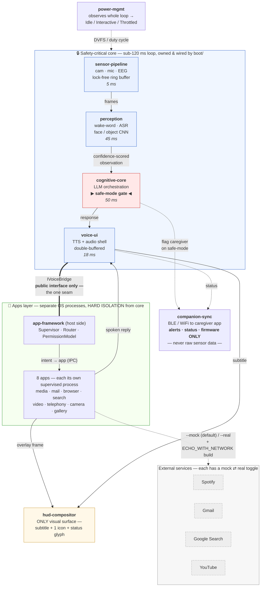

# ECHO OS — Architecture

A 10-second mental model of the system, then a short walkthrough of the two
things that matter most: the **safety-critical core loop** and the **hard
isolation boundary** between that loop and the apps layer.

This document describes what is actually in the repo today. Where a path is a
laptop stand-in or still stubbed, it says so — see [STATE.md](STATE.md) for the
full built-vs-pending breakdown.

## System diagram

> **Reading the lines.** Solid arrows in the blue box are the real-time data path
> (sensor → perception → cognitive → voice). Dotted lines are out-of-band
> signals (power scaling, caregiver alerts, mock/real toggles). The double line
> is the **single sanctioned seam** between the apps layer and the core: apps
> reach core audio through `IVoiceBridge` — `voice-ui`'s *public* interface — and
> nothing else.

## The core loop (blue box)

The safety-critical path is four modules wired in one direction by the `Runtime`
in [`boot/`](../boot). Every stage carries a slice of the **120 ms
perception-to-response budget**, which is encoded as data in
[`common/include/echo/latency.hpp`](../common/include/echo/latency.hpp) and
asserted by a unit test — a build-enforced contract, not a comment.

1. **sensor-pipeline** captures camera/mic/EEG frames and hands them to
   perception over a **single-producer/single-consumer lock-free ring buffer**
   ([`ring_buffer.hpp`](../sensor-pipeline/include/echo/sensor/ring_buffer.hpp)),
   so capture never blocks inference. *(5 ms)*
2. **perception** runs wake-word detection, ASR, and the quantized face/object
   CNN, emitting a **confidence-scored** `Perception` observation. *(45 ms)*
3. **cognitive-core** is where design principle #5 — *"fail safe, not smart"* —
   lives. It is the **safe-mode gate** (below). *(50 ms)*
4. **voice-ui** speaks the response through a double-buffered, tone-aware audio
   shell (reassuring vs. neutral), and drives the HUD subtitle. *(18 ms)*

`power-mgmt` observes the whole loop and trades duty cycle for thermal headroom
without stuttering an in-flight response; `companion-sync` receives caregiver
alerts and status but **never** sensor data.

### The safe-mode gate — the heart of the product

The device is worn by people living with memory loss, so a confident wrong
answer is worse than no answer. In
[`cognitive-core`](../cognitive-core/include/echo/cognitive/cognitive_core.hpp),
`respond()` scores its confidence against `SafeModeConfig::min_confidence`
(default **0.72**). Below that threshold — or on any model failure — it does
**not** let the LLM guess. It returns a `ResponseKind::SafeMode` response: a
short, warm, known-good line (*"I'm not quite sure right now. Let's take a
moment."*) and sets `flag_caregiver = true`, which `companion-sync` turns into a
`SafeModeEngaged` alert. The interface guarantees this: `respond()` never throws;
a failure degrades to safe mode rather than propagating.

## The isolation boundary (green box)

The apps layer — media, mail, browser, search, video, telephony, camera,
gallery — sits *beside* the core, not inside it. The boundary is real, not
aspirational, and it is drawn **in the build graph**:

- **Apps are separate OS processes.** `app-framework`'s `Supervisor` spawns each
  app as its own child process, detects a crash or hang, and restarts it with
  bounded backoff. A misbehaving app is a local event that **cannot block, slow,
  or crash** the sub-120 ms loop.
- **`echo::app-sdk` links no core module.** The half of the framework an app
  links (contract, permissions, HUD primitives, IPC codec, intent parser) has
  **zero** dependency on `perception`, `cognitive-core`, or the sensor path —
  enforced by CMake, not by comment.
- **One seam only: `IVoiceBridge`.** The single point where an app's output
  reaches the core is the voice bridge, which calls `voice-ui`'s *public*
  interface to speak a line. Apps never touch core internals or the latency
  budget.
- **The HUD is the only screen.** There is no window manager and no framebuffer.
  The [`hud-compositor`](../apps/hud-compositor) exposes exactly three overlay
  primitives — subtitle text, one icon, a status glyph — and nothing else. A
  scrollable list or a tappable button is *not expressible*. This is design
  principle #1 (premium and calm) made structural.

### The mock ⇄ real toggle

Every external dependency has a clean interface with two backends behind it, so
the whole voice flow is testable today and real credentials slot in later with
**zero interface changes**:

| Dependency | Mock (default) | Real path | Selected by |
|------------|----------------|-----------|-------------|
| Spotify / Gmail / Search / YouTube | realistic fake data | live API backend | `--real` flag **and** `-DECHO_WITH_NETWORK=ON` build |
| Wake word / ASR / LLM / TTS / vision | deterministic stub adapters | whisper.cpp · llama.cpp · Piper · Porcupine · OpenCV | `ECHO_WITH_*` CMake options (all default OFF; `-DECHO_REAL_AI=ON` flips all) |
| HUD / mic / speaker I/O | headless / typed input | SDL2 laptop overlay + audio | `-DECHO_WITH_SDL=ON` |
| Network transport | absent (backends report `Unavailable`) | libcurl | `-DECHO_WITH_NETWORK=ON` |

The default build is **dependency-free**: every toggle is OFF, so the stub build
compiles on any host toolchain and stays deterministic in CI. See the
[README](../README.md) Phase 3 and Phase 5 sections for the per-engine detail.

## Where to look next

- **What's built vs. pending, and coverage by module:** [STATE.md](STATE.md)
- **How to actually run the real stack, end to end:** [RUNBOOK.md](RUNBOOK.md)
- **Why it's built this way (the architectural choices):** [DECISIONS.md](DECISIONS.md)
